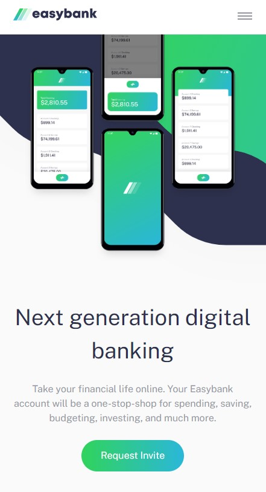

# Frontend Mentor - Easybank landing page solution

This is a solution to the [Easybank landing page challenge on Frontend Mentor](https://www.frontendmentor.io/challenges/easybank-landing-page-WaUhkoDN). Frontend Mentor challenges help you improve your coding skills by building realistic projects.

## Table of contents

- [Overview](#overview)
  - [The challenge](#the-challenge)
  - [Screenshot](#screenshot)
  - [Links](#links)

## Overview

### The challenge

Users should be able to:

- View the optimal layout for the site depending on their device's screen size
- See hover states for all interactive elements on the page

### Screenshot

### Links

- Solution URL: [LINK](https://www.frontendmentor.io/solutions/frontend-mentor-easybank-landing-page-html-css-js-Il0qD72u_E)
- Live Site URL: [LINK](https://rafalkrawczuk.github.io/Frontend-Mentor-Easybank-landing-page-HTML-CSS-JS/)
